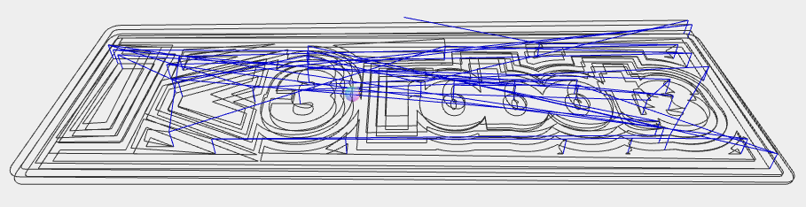
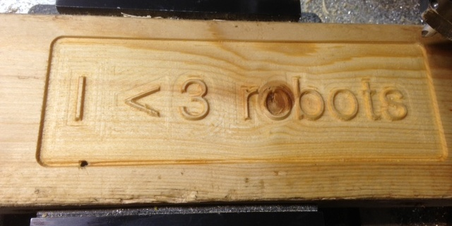
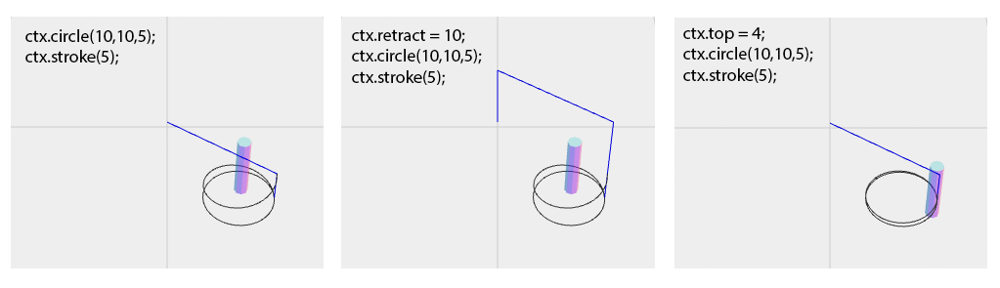
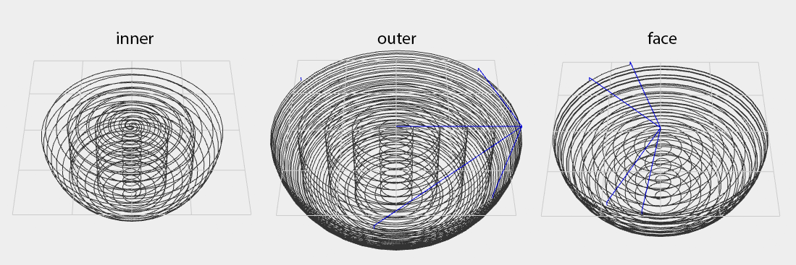

Gcanvas
========
An HTML5 Canvas implementation that generates Gcode for 4 axis CNC milling. 

### Installation
First make sure you have [nodejs](http://nodejs.org) installed.
```
npm install -g gcanvas
```

### Example
example.js
```
function main(ctx) {
  ctx.translate(-90,0);
  ctx.toolDiameter = 1/8*25.4;
  ctx.depth = 5;
  ctx.font = '20pt Helvetiker';
  roundRect(ctx, 0,0,180,60,5);
  ctx.text('I  < 3  robots', 12, 40);
  ctx.fill('evenodd');
}

function roundRect(ctx, x, y, w, h, r) {
  if (w < 2 * r) r = w / 2;
  if (h < 2 * r) r = h / 2;
  ctx.moveTo(x+r, y);
  ctx.arcTo(x+w, y,   x+w, y+h, r);
  ctx.arcTo(x+w, y+h, x,   y+h, r);
  ctx.arcTo(x,   y+h, x,   y,   r);
  ctx.arcTo(x,   y,   x+w, y,   r);
  ctx.closePath();
}
```
```
$ gcanvas example.js | gsim
```

```
$ gcanvas example.js | mycnc
```


### Non-standard extensions to Canvas 

#### Properties

* `ctx.toolDiameter` This must be set for fill() to work because it has to calculate tool offsets. stroke() only requires toolDiameter if align is not center.

* `ctx.depth` Specifies the total depth to cut into the work. If not set the Z axis never changes. 

* `ctx.depthOfCut` Specifies an incrementing depth of cut in layers up to `ctx.depth`.

* `ctx.top` The Z offset to the top of work surface. When this is set all cuts with plunge down to this depth before spiraling to their full depth. Use cautiously. If the actual work surface is closer this will break tools. I often use this in tandem with facing. First I align the tool to something within 1mm of the lowest part of my material surface, face it down to 1mm, then set ctx.top to 1mm. I then update ctx.top for every tool change.
  ```
  function main(ctx) {
    step('face', function() {
      ctx.depth = 1;
      ctx.fillRect(-20,-20,40,40);
    });

    // Outside of a step, applies to all steps after facing
    // even if they are run independently.
    ctx.top = 1;

    step('10mm hole', function() {
      ctx.depth = 20; // 20mm deep
      ctx.circle(0,0,10);
      ctx.fill();
    });
  }

  ```

* `ctx.retract` Set a small distance to retract the tool between rapid moves to overcome imperfect surface tolerances. This is a simpler alternative to ctx.top when the work surface is flat and the tool can be aligned initially to surface zero. i.e. sheet stock. (default: 0)

  

* `ctx.feed` Sets the effective feedrate.
   To support coordinated axial and linear motion Gcanvas always generates inverse time mode feeds
   based on the distance of the linear motion, making axial feeds slave to linear.

* `ctx.speed` Sets the spindle speed by sending a single S command.

* `ctx.coolant` Can be true, false, "mist" (M07) or "flood" (M08). True defaults to "flood".

* `ctx.align` Can be 'inner', 'outer', or 'center' (default). Non-center alignment closes the path.

* `ctx.atc` Auto tool change. Sends `M06 T{ctx.atc}`. Make sure you update toolDiameter.

* `ctx.unit` (mm|inch) Set unit mode. G20/G21

* `ctx.ramping` (true|false) Ramping eases into the depth of cut helically. The alternative is to plunge directly down to depth for each cut. It can reduce cutting time to disable this when you use a center-cutting endmill on forgiving material. (default: true)


#### Methods

##### `ctx.fill([windingRule, depth])`
##### `ctx.fill([depth])`
Standard canvas fill(), but extended to allow a number for depth.

* `windingRule`: 'nonzero' or 'evenodd'. (default: 'nonzero') 
* `depth`: Full depth to mill the current path to. (default: ctx.depth)

##### `ctx.stroke([align, depth])`
##### `ctx.stroke([depth])`
Standard canvas stroke(), but can also take alignment and/or depth.

* `align`: 'inner', 'outer', or 'center'. (default: ctx.align or 'center')
* `depth`: Full depth to mill the current path to. (default: ctx.depth)

##### `ctx.filter(fn)`
Adds a post-processing function before Gcode generation that allows
you to change the parameters.
* `fn`: function(params) i.e. {x: 10, y:20}

Example: Cylindrical wrapping by transposing the X axis onto A
```
ctx.toolDiameter = 1/4*25.5;

var diameter = 10;
var circumference = diameter * Math.PI;

ctx.filter(function(p) {
  p.a = (p.x||0)/circumference*360;
  p.x = 0;
});

ctx.fillRect(0,0,circumference/2,10); // 180 degree slot around cylinder
```


##### `ctx.map(axes)`
Adds a filter that maps the standard coordinate system to another one.
* `axes`: A string representing the new coordinate system.
         You can also use '-' before any axis to make it negative.

Example: Make Z- move towards the bed.
```
ctx.map('xy-z');
```


##### `ctx.peckDrill(x, y, depth[, peck])`
Drills to depth using a peck drilling strategy.
* `depth`: Full depth to drill to.
* `peck`: Length of each peck. (default: ctx.toolDiameter)

##### `ctx.lathe(x, y, attack, pitch, ccw)`
Turning, boring, and facing by controlling XYA to remove the current path as if it were the cross section of a cylinder centered about (0,0). The path is clipped to the bottom right quadrant (x > 0 and y > 0).

* `attack`: 'inner', 'outer', or 'face'
            Use inner for boring, and outer for turning.
            'inner' removes material from the center of a hole outward.
            'outer' removes material from the perimeter of a cylinder inwards.
            'face' removes material from the face of a cylinder through its length.
* `pitch`: Distance to travel per a full rotation.
* `ccw`: Counter-clockwise rotation. (default: false) 

##### `ctx.latheMill(x, y, attack, pitch, ccw)`
Like lathe but instead of a rotary axis it generates helixes in XYZ.

* `attack`: 'inner', 'outer', or 'face'
            Use inner for boring, and outer for turning.
            'inner' removes material from the center of a hole outward.
            'outer' removes material from the perimeter of a cylinder inwards.
            'face' removes material top down.
            

* `pitch`: Distance to travel per a full rotation.
* `ccw`: Counter-clockwise rotation. (default: false) 

##### `ctx.thread(x, y, attack, dmin, dmaj, pitch, start, length, ccw)`
Convenience method for turning threads.
Simply lathe() with a rectangular path.

* `attack`: 'inner' or 'outer'
* `dmin`: Minor diameter of threads.
* `dmaj`: Major diameter of threads.
* `pitch`: Distance between threads.
* `start`: Length to beginning of threads.
* `length`: Full length of threads.
* `ccw`: Counter-clockwise rotation. (default: false) 

##### `ctx.threadMill(x, y, attack, dmin, dmaj, pitch, start, length, ccw)`
Convenience method for milling threads.
Simply latheMill() with a rectangular path.

* `attack`: 'inner' or 'outer'
* `dmin`: Minor diameter of threads.
* `dmaj`: Major diameter of threads.
* `pitch`: Distance between threads.
* `start`: Length to beginning of threads.
* `length`: Full length of threads.
* `ccw`: Counter-clockwise rotation. (default: false) 

Example: 
```
  // M8x1.25 inner threads 10mm deep

  // Metric thread standard precise calculation
  // http://en.wikipedia.org/wiki/ISO_metric_screw_thread
  var dmin = 8-2*5/8*Math.sqrt(3)/2*1.25;

  // Note: Most commerical metric screws I've measured aren't
  // even close to the standard. Manufacturers seem to put huge
  // tolerances in them so they fit almost anywhere.

  step('base hole', function() {
    ctx.toolDiameter = 1/4*25.4;
    ctx.fillCircle(0,0,dmin,12);
  });

  step('thread mill', function() {
    // Single thread cutter.
    ctx.toolDiameter = 1/4*25.4;
    ctx.threadMill(0,0,'inner',dmin-0.1,8,1.25,0,10);
    // Note: We subtract 0.1 just to afford us tolerance.
    // since the true Dmin is determined by the base hole.
  });
```

##### `ctx.text(text, x, y)`
Adds text to the path.
For some reason standard Canvas only has fillText and strokeText.
I don't know why. That makes it impossible to use winding rules.

##### `ctx.circle(x, y, radius)`
Convenience method for full 2pi arc().

##### `ctx.fillRect(x, y, width, height, depth)`
Standard canvas fillRect() with additional depth.

##### `ctx.fillCircle(x, y, width, height, depth)`
Convenience method to fill a circle to depth just like fillRect().


### gcanvas(1)
Gcanvas comes with a command line utility that you can use to write standalone Javascript CNC jobs. Just define a `main(context)` function in the script, and gcanvas will pass it a
pre-built context that outputs to stdout.

```
// helloworld.js
function main(ctx) {
  ctx.strokeText("Hello World");
}
```
```
$ gcanvas helloworld.js | mycnc
```

#### Setups and tool changes

gcanvas(1) exposes a global function `step(name, fn)` which prompts for user
intervention and raises the Z axis to 0.

If the part requires multiple work setups and tool changes, break them into setup blocks:

```
step('1/2" endmill', function(ctx) { 
  ctx.toolDiameter = 1/2*25.4;
  // ...
});

step('face down', function(ctx) { 
  // ...
});
```

### As a library
```
var Gcanvas = require('gcanvas');

var driver = new Gcanvas.GcodeDriver({
  write: function(cmd) {
    console.log(cmd);
  }
});

var ctx = new Gcanvas(driver);
```

### Why
1. Most real life machining is either simple 2.5D shapes,
   or complex geometry. Both of which are easier to do this way than with traditional CAD/CAM software. It breaks down with moderately complex 3D geometry that is not based on mathematic formulas.
2. The Canvas API is well documented and prolific.
3. Especially good for parametric parts.
4. A good basis for implementing more specific Javascript milling tools. e.g. svg, pcbs.


### Additional Notes

#### Center cutting and non-center cutting endmills.
  The strategy for filling always tries to avoid center cutting
  unless it is unavoidable. For instance, if you try to fill a 15mm circle with a 5mm endmill it will start by milling a 10mm circle and finish with a full 15mm circle, which can be done with a non-center cutting endmill. But, if you try to fill an 8mm circle with a 5mm endmill it will assume you have the right tool to do so, and proceed without caution. Just make sure that what you're telling Gcanvas to do is actually possible and you won't have any problems. It always tends to work out that we use the simplest tool for the job - mainly because they are cheaper. Knowing this, Gcanvas avoids a lot of annoying configuration by making the most conservative assumptions.

#### Climb milling
  Gcanvas always tries to climb mill. Since it doesn't know the stock material, it sort of "guesses". But the guesses are pretty reliable.
  It bases what the outside or inside of the material is on alignment. If you do an outer stroke() it will always normalize and follow the path clockwise, or counter-clockwise for inner stroke().  

  In the case of lathe()/latheMill() 'inner' and 'outer' attack also
  always determine clockwise or counter-clockwise rotational direction.
  The physical thread direction is acheived by how the cutter traverses the length, one end to another.

### License

MIT

[](https://drone.io/github.com/em/gcanvas/latest)
